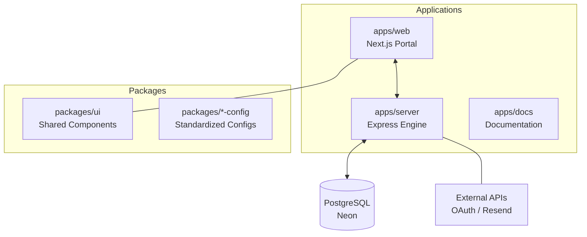

<p align="left">
  
  <h1 style="display: inline-block; vertical-align: middle; margin: 0;">Axonix</h1>
</p>

Axonix is a high-performance, **Agentic Workflow Automation** platform designed to streamline complex business processes through a visual, node-based automation engine. Built on a modern Turborepo monorepo architecture, Axonix provides a seamless experience from design to execution.

Developed by **[lwshakib](https://github.com/lwshakib)**.

---

## 🏗️ Architecture Overview

Axonix is organized as a monorepo, ensuring high modularity and shared logic across the entire ecosystem.



### 📱 Applications
- **[web](file:///d:/axonix/apps/web)**: The primary frontend built with Next.js (App Router). Features a visual workflow builder, authentication dashboards, and real-time execution monitoring.
- **[server](file:///d:/axonix/apps/server)**: The core backend engine using Node.js/Express. It handles authentication, data persistence (Postgres), and the workflow execution sequence.
- **[docs](file:///d:/axonix/apps/docs)**: Documentation portal built with Next.js to provide guides and API references.

### 📦 Shared Packages
- **[ui](file:///d:/axonix/packages/ui)**: A comprehensive, React-based UI component library powered by TailwindCSS and Radix UI.
- **[typescript-config](file:///d:/axonix/packages/typescript-config)**: Standardized TypeScript configurations used across all projects.
- **[eslint-config](file:///d:/axonix/packages/eslint-config)**: Shared linting rules to maintain code quality.

---

## ⚙️ Tech Stack

- **Core**: Turborepo, pnpm
- **Frontend**: Next.js, TypeScript, TailwindCSS, @xyflow/react
- **Backend**: Node.js, Express, Passport.js, Winston (Logging)
- **Database**: PostgreSQL (Neon)
- **Email/Storage**: Resend, Cloudflare R2 (S3 compatible)

---

## 🚀 Getting Started

Follow these steps to set up the Axonix ecosystem locally.

### 1. Prerequisites
Ensure you have the following installed:
- [Node.js](https://nodejs.org/) (Version 18 or higher)
- [pnpm](https://pnpm.io/) (Version 9 or higher)

### 2. Installation
Clone the repository and install dependencies from the root directory:
```sh
pnpm install
```

### 3. Environment Configuration
You need to set up environment variables for both the frontend and the backend.

#### **Backend Setup**
Copy the example file in the `server` directory and fill in your credentials:
```sh
cp apps/server/.env.example apps/server/.env
```
Key configurations include `DATABASE_URL`, `GOOGLE_CLIENT_ID`, `GITHUB_CLIENT_ID`, and `RESEND_API_KEY`.

#### **Frontend Setup**
Copy the example file in the `web` directory:
```sh
cp apps/web/.env.example apps/web/.env
```
Ensure `NEXT_PUBLIC_API_URL` points to your running backend (default: `http://localhost:8080/api/v1`).

### 4. Running the Project
Start the development server for all applications and packages simultaneously:
```sh
pnpm run dev
```
Alternatively, build the production bundles:
```sh
pnpm run build
```

---

## 🔥 Key Features

- **Visual Workflow Builder**: Intuitive node-based editor for designing complex logic.
- **SSE Real-time Streaming**: Monitor workflow execution status live via Server-Sent Events.
- **Dynamic Interpolation**: Pass data between workflow steps using `{{ $json.key }}` syntax.
- **Multi-tenant Auth**: Secure Google and GitHub OAuth integration.
- **Shared UI Logic**: Consistent design system shared between documentation and the main application.

---

## 🛠️ Commands

- `pnpm run build` - Build all apps and packages.
- `pnpm run dev` - Start development servers with hot-reloading.
- `pnpm run lint` - Lint all packages.
- `pnpm run format` - Format the entire codebase using Prettier.
- `pnpm run check-types` - Perform static type checks in all packages.

---

## 📄 License

Maintained by **lwshakib**. 
